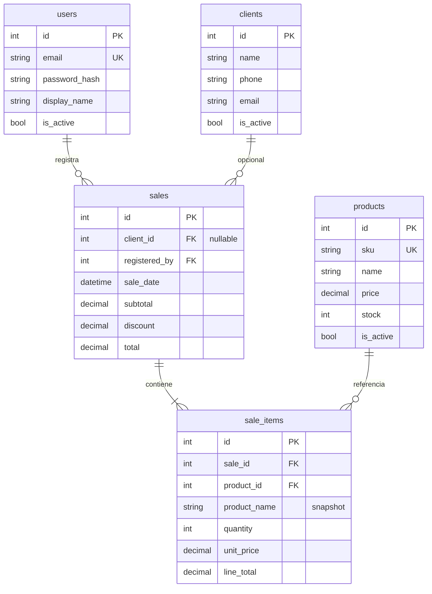

# Modelo de datos — Shop With Mel

## Diagrama ER

## Reglas de negocio (en la app)

| Acción | Comportamiento |
|--------|----------------|
| Crear venta | Transacción: insertar `sales` + `sale_items`, restar `products.stock` |
| Cliente opcional | `sales.client_id` puede ser NULL (venta mostrador) |
| Borrar producto/cliente | Soft delete: `is_active = 0` |
| Historial | Filtrar `sales.sale_date` por rango de fechas |
| Detalle de venta | `sale_items.product_name` guarda el nombre al momento de la venta |
